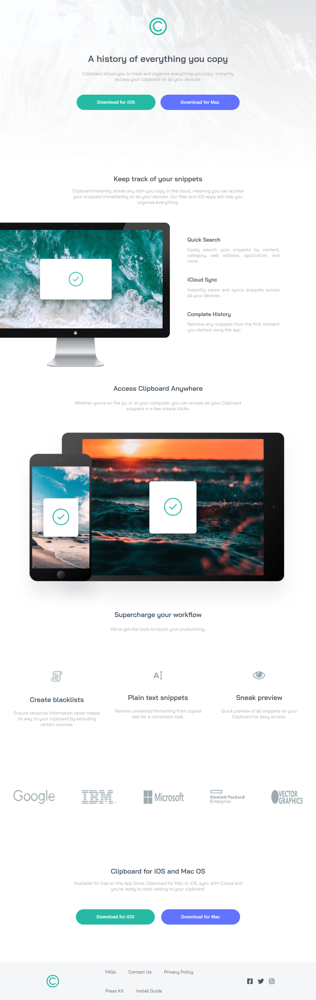

# Clipboard landing page

This is a clipboard landing page implemented using HTML, CSS, and JavaScript. It includes responsive web design, a floating "scroll to top" button, and the use of semantic HTML.

# Table of contents

- [Overview](#overview)
  - [Features](#features)
  - [Screenshot](#screenshot)
  - [Links](#links)
- [Author](#author)

# Overview

The Clipboard Landing Page project aims to create a visually appealing landing page for a clipboard application. It showcases the application's features and benefits and provides users with a convenient way to scroll back to the top of the page.

### Features

- **Responsive Web Design**: The landing page is designed to be responsive, ensuring a seamless user experience across various devices and screen sizes.

- **Floating "Scroll to Top" Button**: The project includes a JavaScript implementation of a floating button that appears when the user scrolls down a certain distance. Clicking on the button smoothly scrolls the page back to the top.

- **Semantic HTML**: The project utilizes semantic HTML elements to structure the page and provide meaningful information to assistive technologies and search engines.

### Screenshot

### Learning Highlights

- **Floating Button Implementation**: Using JavaScript, a floating "scroll to top" button was implemented. This involved detecting the scroll position and dynamically showing or hiding the button accordingly. The smooth scrolling effect was achieved using the window.scrollTo method with the behavior: 'smooth' option.

### Links

- Solution URL: [Github repo](https://github.com/julius-tamale/clipboardLandingPage)
- Live Site URL: [Clipboard landing page](https://fmclipboard.netlify.app)

## Author

- Website - [Julius Tamale](https://julius-tamale.netlify.app)
- Frontend Mentor - [@julius](https://www.frontendmentor.io/profile/julius-tamale)
- Twitter - [@tjewlius](https://www.twitter.com/tjewlius)